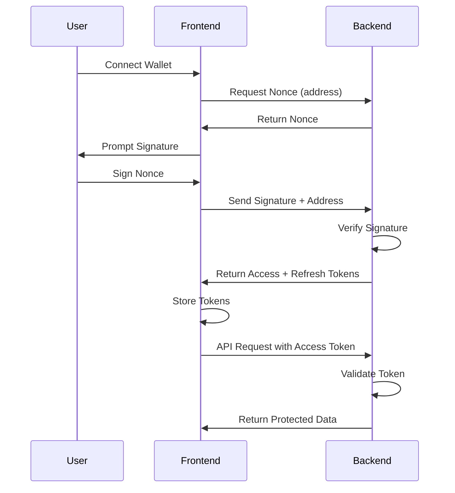

# JWT Authentication Flow

This document explains the complete JWT authentication flow implemented in the Poldex Casino DApp.

## Overview

The authentication flow uses wallet signature verification with JWT tokens for secure access to protected resources. It includes:

1. Nonce generation for signature challenge
2. Wallet signature verification
3. JWT access and refresh token generation
4. Token-based authentication for API requests
5. Token refresh mechanism
6. Secure logout

## Flow Diagram



## Implementation Details

### Backend

1. **Nonce Generation** (`/auth/nonce`)
   - Generates a unique nonce for wallet signature challenge
   - Stores nonce with 5-minute expiration

2. **Login** (`/auth/login`)
   - Validates wallet signature using viem
   - Generates JWT access token (15 min expiry) and refresh token (7 days expiry)
   - Stores refresh token in database

3. **Token Refresh** (`/auth/refresh`)
   - Validates refresh token
   - Issues new access token

4. **Logout** (`/auth/logout`)
   - Invalidates refresh token
   - Adds token to blacklist

5. **JWT Guards**
   - `JwtAuthGuard`: For protecting specific routes
   - `GlobalJwtGuard`: For protecting all routes (except auth routes)

### Frontend

1. **Authentication Hooks**
   - `useNonce`: Fetches nonce for wallet address
   - `useLogin`: Handles login with signature
   - `useRefreshToken`: Refreshes access token
   - `useLogout`: Handles user logout

2. **State Management**
   - Zustand store for authentication state
   - Persists refresh token in localStorage

3. **API Interceptors**
   - Automatically adds access token to requests
   - Handles token refresh on 401 responses

## Security Features

1. **Short-lived Access Tokens**: 15-minute expiration
2. **Long-lived Refresh Tokens**: 7-day expiration
3. **Token Blacklisting**: Invalidated tokens stored for 30 days
4. **One-time Nonces**: Nonces deleted after use
5. **Signature Verification**: Uses viem for secure signature recovery
6. **Protected Routes**: All backend routes (except auth) require valid JWT

## Usage Examples

### Frontend

```typescript
// Login
const { mutate: login } = useLogin();
login({ address, signature });

// Protected API call
const { getProtectedData } = useProtectedApi();
const data = await getProtectedData('/protected/data');

// Logout
const { mutate: logout } = useLogout();
logout();
```

### Backend

```typescript
// Protect a route
@UseGuards(JwtAuthGuard)
@Get('profile')
getProfile(@Request() req) {
  return req.user;
}

// Access user data
// req.user.address contains the wallet address
```

## Error Handling

1. **Invalid Signature**: Returns 401 Unauthorized
2. **Expired Nonce**: Returns 401 Unauthorized
3. **Expired Access Token**: Automatically refreshes using refresh token
4. **Expired Refresh Token**: Requires re-authentication
5. **Blacklisted Token**: Returns 401 Unauthorized

## Database Schema

The authentication system uses three main tables:

1. **WalletNonce**: Stores nonces for signature challenges
2. **RefreshToken**: Stores refresh tokens for session management
3. **BlacklistedToken**: Stores invalidated tokens to prevent reuse