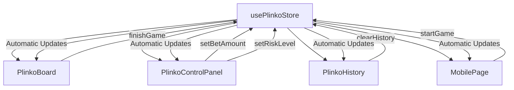

# Zustand State Management Guide - Plinko Game

## 📋 Visão Geral

Este projeto demonstra como usar **Zustand** para compartilhar propriedades e estado entre componentes React de forma eficiente e sem prop drilling.

## 🎯 Por que Zustand?

### Vantagens:
- ✅ **Simplicidade**: API minimalista e intuitiva
- ✅ **Performance**: Re-renderizações otimizadas
- ✅ **TypeScript**: Suporte completo com tipagem
- ✅ **Persistência**: Estado automaticamente salvo/carregado
- ✅ **Boilerplate mínimo**: Menos código que Redux
- ✅ **Flexibilidade**: Múltiplas stores independentes

## 🏗️ Estrutura do Projeto

```
src/
├── stores/
│   ├── plinkoStore.ts      # Store principal do jogo Plinko
│   ├── navigationStore.ts # Store de navegação
│   └── gameStore.ts        # Store genérico de jogos
├── components/
│   └── game/
│       ├── PhaserGame.tsx           # Componente do game engine
│       ├── PlinkoControlPanel.tsx   # Painel de controles
│       └── PlinkoHistory.tsx        # Histórico de jogadas
└── app/
    └── (mobile)/m/page.tsx # Página principal do mobile
```

## 🔧 Implementação da Store

### 1. Definindo a Store (plinkoStore.ts)

```typescript
import { create } from 'zustand';
import { persist } from 'zustand/middleware';

// Interfaces e tipos
interface PlinkoState {
  // Estado do jogo
  balance: number;
  isPlaying: boolean;
  animating: boolean;
  settings: PlinkoSettings;
  
  // Ações
  setBetAmount: (amount: number) => void;
  startGame: () => boolean;
  finishGame: (result: PlinkoResult) => void;
  // ... outras ações
}

// Criando a store com persistência
export const usePlinkoStore = create<PlinkoState>()(persist(
  (set, get) => ({
    // Estado inicial
    balance: 1000,
    isPlaying: false,
    animating: false,
    settings: DEFAULT_SETTINGS,
    
    // Implementação das ações
    setBetAmount: (amount: number) => {
      set((state) => ({
        settings: { ...state.settings, betAmount: amount }
      }));
    },
    
    startGame: () => {
      const state = get();
      if (!state.canAffordBet()) return false;
      
      set({
        isPlaying: true,
        animating: true,
        balance: state.balance - state.settings.betAmount
      });
      
      return true;
    },
    
    // ... outras implementações
  }),
  {
    name: 'plinko-game-state', // Nome da chave no localStorage
    partialize: (state) => ({  // Apenas salvar partes específicas
      balance: state.balance,
      settings: state.settings
    })
  }
));
```

### 2. Usando a Store em Componentes

#### Componente Principal (page.tsx)
```typescript
'use client'

import { usePlinkoStore } from '@/stores/plinkoStore';

export default function MobilePlinkoPage() {
  // Acessando estado e ações da store
  const { 
    balance,          // Estado: saldo atual
    settings,         // Estado: configurações do jogo
    isPlaying,        // Estado: jogo em andamento
    setBetAmount,     // Ação: definir valor da aposta
    startGame,        // Ação: iniciar jogo
    canAffordBet      // Computed: pode pagar a aposta
  } = usePlinkoStore();

  const handlePlayClick = () => {
    if (canAffordBet() && !isPlaying) {
      startGame(); // Chama ação da store
    }
  };

  return (
    <div>
      <div>Saldo: {balance}</div>
      <button onClick={handlePlayClick}>
        Jogar ({settings.betAmount})
      </button>
    </div>
  );
}
```

#### Componente de Controles (PlinkoControlPanel.tsx)
```typescript
import { usePlinkoStore } from '@/stores/plinkoStore';

export const PlinkoControlPanel = () => {
  // Mesmo hook, diferentes propriedades
  const {
    settings,
    setBetAmount,
    setRiskLevel,
    getStats
  } = usePlinkoStore();

  return (
    <div>
      <input 
        value={settings.betAmount}
        onChange={(e) => setBetAmount(Number(e.target.value))}
      />
      
      <select 
        value={settings.risk}
        onChange={(e) => setRiskLevel(e.target.value)}
      >
        <option value="low">Baixo Risco</option>
        <option value="high">Alto Risco</option>
      </select>
    </div>
  );
};
```

#### Componente de Histórico (PlinkoHistory.tsx)
```typescript
import { usePlinkoStore } from '@/stores/plinkoStore';

export const PlinkoHistory = () => {
  // Acessa histórico e função de limpar
  const { history, clearHistory } = usePlinkoStore();

  return (
    <div>
      <button onClick={clearHistory}>Limpar Histórico</button>
      {history.map((result, index) => (
        <div key={index}>
          Multiplicador: {result.multiplier}x
          Pagamento: {result.payout}
        </div>
      ))}
    </div>
  );
};
```

## 🔄 Fluxo de Dados



## 🎨 Padrões de Uso

### 1. Ações Síncronas
```typescript
// Simples atualização de estado
const { setBetAmount } = usePlinkoStore();
setBetAmount(100);
```

### 2. Ações Assíncronas
```typescript
// Ação que retorna resultado
const { startGame } = usePlinkoStore();
const success = startGame(); // boolean
if (!success) {
  toast.error('Saldo insuficiente!');
}
```

### 3. Computed Values (Getters)
```typescript
// Valores calculados baseados no estado
const { getStats, canAffordBet } = usePlinkoStore();

const stats = getStats(); // Calcula estatísticas
const canPlay = canAffordBet(); // Verifica se pode jogar
```

### 4. Estado Derivado
```typescript
// Estado que depende de outros estados
const { settings, balance } = usePlinkoStore();

const maxPossibleBet = Math.min(balance, 1000);
const riskMultiplier = settings.risk === 'high' ? 2 : 1;
```

## 🛡️ Boas Práticas

### 1. Organização da Store
```typescript
// ✅ Bom: Agrupamento lógico
interface PlinkoState {
  // Estados relacionados ao jogo
  gameState: {
    isPlaying: boolean;
    animating: boolean;
  };
  
  // Estados relacionados ao jogador
  playerState: {
    balance: number;
    settings: PlinkoSettings;
  };
  
  // Ações organizadas por categoria
  gameActions: {
    startGame: () => boolean;
    finishGame: (result: PlinkoResult) => void;
  };
}
```

### 2. Imutabilidade
```typescript
// ✅ Bom: Mantém imutabilidade
setBetAmount: (amount: number) => {
  set((state) => ({
    settings: { ...state.settings, betAmount: amount }
  }));
}

// ❌ Ruim: Mutação direta
setBetAmount: (amount: number) => {
  set((state) => {
    state.settings.betAmount = amount; // ❌ Mutação!
    return state;
  });
}
```

### 3. Separação de Responsabilidades
```typescript
// ✅ Bom: Store para cada domínio
const plinkoStore = usePlinkoStore();    // Jogo Plinko
const navigationStore = useNavigationStore(); // Navegação
const authStore = useAuthStore();        // Autenticação

// ❌ Ruim: Store monolítica
const megaStore = useMegaStore(); // Tudo em uma store
```

### 4. Tipagem Forte
```typescript
// ✅ Bom: Interfaces bem definidas
interface PlinkoResult {
  multiplier: number;
  payout: number;
  betAmount: number;
  timestamp: Date;
}

// ✅ Bom: Ações tipadas
setBetAmount: (amount: number) => void;
setRiskLevel: (risk: 'low' | 'average' | 'high') => void;
```

## 🔧 Configurações Avançadas

### 1. Persistência Seletiva
```typescript
export const usePlinkoStore = create<PlinkoState>()(persist(
  // ... implementação da store
  {
    name: 'plinko-game-state',
    partialize: (state) => ({
      // Apenas salvar dados importantes
      balance: state.balance,
      settings: state.settings,
      // NÃO salvar estado temporário
      // isPlaying: state.isPlaying,
      // animating: state.animating,
    })
  }
));
```

### 2. Middleware Personalizado
```typescript
const logger = (config) => (set, get, api) =>
  config(
    (...args) => {
      console.log('Estado anterior:', get());
      set(...args);
      console.log('Novo estado:', get());
    },
    get,
    api
  );

export const usePlinkoStore = create<PlinkoState>()(
  logger(
    persist(
      // ... implementação
    )
  )
);
```

### 3. Subscriptions (Observadores)
```typescript
// Observar mudanças específicas
const unsubscribe = usePlinkoStore.subscribe(
  (state) => state.balance,
  (balance, previousBalance) => {
    if (balance > previousBalance) {
      toast.success(`Ganhou ${balance - previousBalance} créditos!`);
    }
  }
);

// Limpar subscription quando necessário
useEffect(() => {
  return () => unsubscribe();
}, []);
```

## 🚀 Exemplos Práticos

### 1. Sistema de Auto-Play
```typescript
// Store
interface PlinkoState {
  isAutoPlay: boolean;
  autoPlayCount: number;
  maxAutoPlays: number;
  
  startAutoPlay: () => void;
  stopAutoPlay: () => void;
}

// Implementação
startAutoPlay: () => {
  const state = get();
  if (!state.canAffordBet()) return;
  
  set({ isAutoPlay: true, autoPlayCount: 0 });
  
  const playNext = () => {
    const currentState = get();
    if (currentState.autoPlayCount < currentState.maxAutoPlays) {
      currentState.startGame();
    } else {
      currentState.stopAutoPlay();
    }
  };
  
  playNext();
}

// Uso no componente
const AutoPlayButton = () => {
  const { isAutoPlay, startAutoPlay, stopAutoPlay } = usePlinkoStore();
  
  return (
    <button onClick={isAutoPlay ? stopAutoPlay : startAutoPlay}>
      {isAutoPlay ? 'Parar Auto-Play' : 'Iniciar Auto-Play'}
    </button>
  );
};
```

### 2. Sistema de Estatísticas
```typescript
// Computed values para estatísticas
getStats: (): PlinkoStats => {
  const { history } = get();
  
  return {
    totalGames: history.length,
    totalWinnings: history.reduce((sum, game) => sum + game.payout, 0),
    winRate: history.filter(game => game.payout > 0).length / history.length * 100,
    maxMultiplier: Math.max(...history.map(game => game.multiplier))
  };
}

// Componente de estatísticas
const StatsDisplay = () => {
  const { getStats } = usePlinkoStore();
  const stats = getStats();
  
  return (
    <div>
      <div>Jogos: {stats.totalGames}</div>
      <div>Taxa de Vitória: {stats.winRate.toFixed(1)}%</div>
      <div>Maior Multiplicador: {stats.maxMultiplier}x</div>
    </div>
  );
};
```

## 🔍 Debugging e Ferramentas

### 1. DevTools
```typescript
import { devtools } from 'zustand/middleware';

export const usePlinkoStore = create<PlinkoState>()(
  devtools(
    persist(
      // ... implementação
    ),
    { name: 'plinko-store' } // Nome no Redux DevTools
  )
);
```

### 2. Logging Personalizado
```typescript
// Middleware para logging
const withLogging = (config) => (set, get, api) =>
  config(
    (partial, replace) => {
      console.log('🎯 Zustand Update:', partial);
      set(partial, replace);
    },
    get,
    api
  );
```

## 📈 Performance

### 1. Seletores Otimizados
```typescript
// ✅ Bom: Apenas re-renderiza quando balance muda
const balance = usePlinkoStore((state) => state.balance);

// ❌ Ruim: Re-renderiza em qualquer mudança
const { balance } = usePlinkoStore();
```

### 2. Memorização de Computações
```typescript
import { useMemo } from 'react';

const StatsComponent = () => {
  const history = usePlinkoStore((state) => state.history);
  
  // Memoriza cálculo pesado
  const stats = useMemo(() => {
    return calculateComplexStats(history);
  }, [history]);
  
  return <div>{/* Renderizar stats */}</div>;
};
```

## 🎯 Conclusão

Este guia demonstra como usar Zustand para:

1. **Centralizar estado** do jogo Plinko
2. **Compartilhar dados** entre componentes sem prop drilling
3. **Manter persistência** de dados importantes
4. **Organizar ações** de forma clara e tipada
5. **Otimizar performance** com seletores específicos

### Principais Benefícios Obtidos:
- ✅ Código mais limpo e organizado
- ✅ Manutenção simplificada
- ✅ Re-renderizações otimizadas
- ✅ Estado persistente entre sessões
- ✅ TypeScript com tipagem completa
- ✅ Debugging facilitado com DevTools

O Zustand provou ser uma excelente escolha para gerenciamento de estado neste projeto, proporcionando uma API simples mas poderosa para compartilhar propriedades e estado entre componentes React.